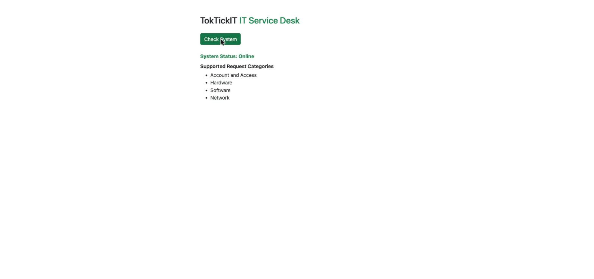
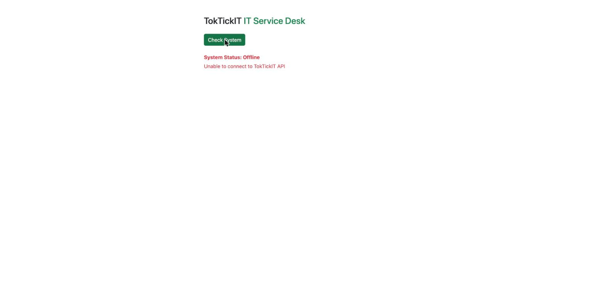

# Lab 1 — Test Plan and Evidence

This documents what each automated test checks, how to run the suites, and proof they pass on `main`.

## What is being tested and why

TokTickIT's Lab 1 slice has two moving parts that need independent proof of correctness: the Express API (talking to PostgreSQL through Prisma) and the React UI (talking to that API). Each Issue's acceptance criteria maps to one or more tests below, so a green suite is direct evidence the criteria are met — not just that the code compiles.

## Test matrix

| # | Test file | Tool | Issue | What it proves |
|---|-----------|------|-------|-----------------|
| API-01 | `server/tests/lab-01/health.test.ts` | Vitest + Supertest | 2 | `GET /api/health` returns HTTP 200 with body `{ status: "ok", service: "TokTickIT API" }` — proves the Express server boots and responds. |
| API-02 | `server/tests/lab-01/categories.test.ts` | Vitest + Supertest | 3, 4 | `GET /api/categories` returns HTTP 200 with the four seeded categories, in ascending `id` order: Account and Access, Hardware, Software, Network — proves the Prisma model, the seed script, and the route all agree. |
| UI-01 | `client/tests/lab-01/App.test.tsx` | Vitest + React Testing Library | 4 | The `TokTickIT` heading renders — smoke test that the app mounts. |
| UI-02 | `client/tests/lab-01/App.test.tsx` | Vitest + RTL + `userEvent` | 4 | Clicking "Check System" with a mocked successful API call flips the UI to `System Status: Online` and lists the seeded category names (e.g. "Hardware") — proves the idle → loading → success state transition and rendering. |
| UI-03 | `client/tests/lab-01/App.test.tsx` | Vitest + RTL + `userEvent` | 4 | Clicking "Check System" with a mocked failed API call flips the UI to `System Status: Offline` and shows "Unable to connect..." — proves the idle → loading → error state transition, so a down API never hangs silently. |

`client/src/api.ts` is mocked with `vi.spyOn` in the UI tests rather than hitting a real server, so the client suite is fast and independent of the database being up. API-01/API-02 do hit a real Express `app` instance (via Supertest) against the actual Postgres database, so they require the DB to be migrated (`npx prisma migrate deploy`) and seeded (`npx prisma db seed`) first.

## How to run

```bash
# server suite — requires PostgreSQL running and DATABASE_URL set (server/.env)
cd server
npx prisma migrate deploy
npx prisma db seed
npm test

# client suite — no DB needed, api.ts is mocked
cd client
npm test
```

## Passing terminal output (re-run on `feature/Lab1Doc`, commit `9f7c1e1`, 2026-08-15)

### Server — `cd server && npx vitest run tests/lab-01/health.test.ts tests/lab-01/categories.test.ts --reporter=verbose`

```
 RUN  v2.1.9 /toktickit/server

 ✓ tests/lab-01/health.test.ts > GET /api/health > returns 200 with status ok and the service name
 ✓ tests/lab-01/categories.test.ts > GET /api/categories > returns the four seeded categories in id order

 Test Files  2 passed (2)
      Tests  2 passed (2)
```

### Client — `cd client && npx vitest run tests/lab-01/App.test.tsx --reporter=verbose`

```
 RUN  v2.1.9 /toktickit/client

 ✓ tests/lab-01/App.test.tsx > App > renders the TokTickIT heading
 ✓ tests/lab-01/App.test.tsx > App > shows Online and the seeded categories on success
 ✓ tests/lab-01/App.test.tsx > App > shows an Offline error message when the API is unavailable

 Test Files  1 passed (1)
      Tests  3 passed (3)
```

## Manual verification (screenshots)

Automated tests mock or isolate each layer; these screenshots show the real UI talking to the real API and database end to end, covering all three UI states.

**Idle** — initial load, before the user has checked the system:


**Success** — after clicking "Check System" with the API and Postgres both up; the four seeded categories are listed in id order:



**Error** — after clicking "Check System" with the API unreachable; the UI fails safely instead of hanging:


